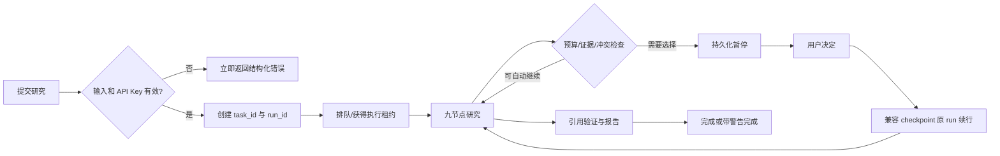

# DeepChoice 下一阶段轻量产品设计方案

> 状态：Draft for implementation planning
>
> 日期：2026-09-09
>
> 适用范围：DeepChoice 单机、个人开发者阶段
>
> 配套技术方案：[技术设计与分阶段实施方案](./technical-design-engineering-enhancement.md)

## 1. 背景、问题与 Why now

DeepChoice 已能完成“澄清—九节点研究—报告”的完整链路，也具备 SQLite checkpoint、SSE 进度、完成/失败快照、检索回退、部分并发限制、Token 汇总与离线 benchmark。下一阶段的主要风险已经不是“能否生成报告”，而是长耗时、外部依赖多的任务能否被可靠管理、解释、恢复和约束。

当前端到端研究历史基准耗时为分钟级；进程重启、外部服务波动、预算耗尽或引用失效时，用户无法获得一致的任务状态和可操作的恢复路径。继续优化研究质量之前，如果没有统一生命周期、预算和追踪基础，后续优化将难以判断收益、定位回归，也容易放大成本与安全风险。

因此本阶段的产品问题是：**让一次 DeepChoice 研究成为可管理、可恢复、可解释、可约束的任务，同时保持个人项目可本地运行、低运维。**

## 2. 目标用户与场景

### 2.1 核心用户

- 项目维护者：本地开发、调试工作流、比较模型或 Prompt 版本、运行离线评测。
- 技术选型使用者：提交一次研究，观察进度，在必要时确认候选或接受降级，最终获得有证据边界的报告。
- API 调用者：以简单 API Key 访问单实例服务，需要稳定的任务状态、错误码和限流反馈。

本阶段不面向企业管理员、多个组织或不互信租户。

### 2.2 关键场景

1. 用户提交耗时研究，刷新页面或服务重启后仍能查询任务并从安全 checkpoint 恢复。
2. 用户发现问题或不再需要结果时取消任务；系统在节点/外部调用边界协作式停止。
3. 系统在 Token、费用、调用次数、并发或总运行时间接近上限时展示预警，并按策略降级、暂停或终止。
4. 报告生成前自动检查引用能否访问、是否真正支持声明、是否重复或错误绑定；证据不足时不伪装成高置信度结论。
5. 只有在高价值且无法由确定性规则安全处理的分歧处请求用户确认，暂停后可继续。
6. 维护者能够按 `run_id` 看到节点耗时、模型、Prompt/工作流版本、重试、Token、错误和降级路径，并把同一数据用于节点级评估。

## 3. 产品目标与成功定义

### 3.1 产品目标

- 任务状态可信：API、前端、checkpoint 与历史查询对同一任务给出一致状态。
- 失败可行动：错误信息说明发生位置、类别、是否可重试、已保存进度和下一步。
- 成本有硬边界：预算在调用前预检、调用后结算，超限不会继续无界调用。
- 证据边界诚实：不可访问、弱支持、重复和错误引用可见且影响置信度。
- 可复现实验：一次运行绑定不可变的模型、Prompt、工作流与报告模板版本。
- 低运维：默认只依赖 SQLite 和本地文件，不要求 Redis、消息队列或外部观测平台。

### 3.2 稳定版本定义

完成 P0 与 P1 后可标记为首个“工程稳定版”，前提是：

- 服务重启后，租约陈旧的 `running` 执行被确定地标记为 `interrupted`，陈旧的 `cancelling` 在确认无有效租约后收敛为 `cancelled`；`queued` 保持待调度，`waiting_for_input` 保持待决定，终态任务可查询。
- 同一任务只允许一个有效执行租约；重复恢复不会产生双重执行或重复扣费。
- 取消和总超时在约定的停止延迟内生效，状态最终收敛。
- 每次 LLM 和检索调用都归属一个 `run_id`，预算账本可对账，节点 Trace 完整。
- 引用验证结果进入报告与置信度计算；错误引用不会作为通过项。
- 公开 API 具备输入上限、简单 Key、请求限流和任务并发保护。
- 相关单元、契约、集成、恢复、并发与安全测试通过；现有研究基准无未解释回归。

历史 300-case 数字仅作为 2026-08-31 快照，不作为本方案验收阈值。新阶段必须建立独立、带日期和数据集版本的回归基线。

## 4. 非目标

- 建设通用 Agent 平台、图形化工作流编排器或第三方插件市场。
- 企业级多租户、RBAC/SSO、组织配额、计费结算、审计合规认证。
- 跨机器分布式调度、Exactly-once 外部副作用、主动—主动高可用。
- 实时大数据 Trace 分析平台或自建可观测性集群。
- 让 LLM 决定认证、预算扣减、URL 安全、状态迁移、重试次数或引用可访问性。
- 在本阶段重写九节点研究算法或新增“预算 Agent”“缓存 Agent”“安全 Agent”。

## 5. 当前痛点

| 痛点 | 当前表现 | 用户影响 |
|---|---|---|
| 任务登记不持久 | 活跃任务与 SSE 事件保存在进程内，快照主要在终态生成 | 重启后运行态丢失，无法可靠取消、恢复或列出失败历史 |
| checkpoint 与产品状态分离 | LangGraph checkpoint 已存在，但不是完整任务目录 | checkpoint 存在不等于可恢复体验成立 |
| 预算只统计、不执行 | 可汇总 Token/调用数，但没有费用、总时长和硬上限决策 | 可能超出用户预期成本或时间 |
| 错误是字符串 | retriever 有统一成功/失败外壳，但跨层错误分类不统一 | 前端无法提供稳定恢复建议 |
| 引用验证不完整 | 已去除伪造标题并按 URL 去重，但缺少在线可访问性与声明支持度验证 | 引用存在不代表当前可访问或支持该声明 |
| 缓存与去重分散 | 无统一的运行内 single-flight、跨运行 TTL 缓存和失效策略 | 重复请求增加延迟与费用 |
| 人工检查点缺失 | 前置澄清可确认候选，但研究中无法可靠暂停/恢复 | 证据不足或冲突难裁时只能自动给结论 |
| 追踪不闭环 | 有节点耗时、部分 Token、诊断 hook 和前端面板，但无统一持久 Trace；同名节点重试会覆盖耗时，澄清 Token 未纳入主汇总 | 难以按运行比较版本、错误和降级路径，成本可能低估 |
| 版本不可冻结 | Prompt 常量散落在模块，模型由环境解析，模板无显式版本 | 历史结果难复现、评测归因不清 |
| API 防护不足 | 研究请求是未建模字典，未见统一认证和全局限流 | 非预期输入、并发和资源耗尽风险 |

## 6. 功能范围与优先级

### 6.1 P0：下一轮业务质量优化前必须完成

| 能力 | 最小范围 | 主要验收 |
|---|---|---|
| 基础契约与结构化错误 | Pydantic 请求/响应、错误分类、节点/适配器契约 | 相同错误在 API、任务记录和 Trace 中有同一 `code`，且不泄露秘密 |
| 持久任务生命周期 | SQLite 任务/运行表、状态机、历史、恢复、取消、总超时 | 重启后状态收敛；恢复幂等；取消可观察 |
| 统一标识与 Trace | `task_id`、`run_id`、checkpoint namespace/id；节点与调用事件 | 任一错误可沿 run→node→call 追溯 |
| 预算硬限制 | Token、估算费用、调用数、运行时间、任务并发 | 调用前拒绝明显超限；调用后精确结算；超限进入明确终态/暂停态 |
| 最小 API 防护 | 输入长度/枚举/URL 限制、任务并发闸；非 loopback 暴露时强制单实例 API Key 与请求限流 | 暴露部署的缺失/错误 Key、超限、过长输入均有稳定响应；loopback 开发可显式关闭 Key |
| 横切安全基线 | 日志脱敏、安全 URL 客户端、Prompt Injection 数据边界、HTML 安全输出 | SSRF 测试、敏感值测试、XSS 测试通过 |

P0 是架构基础。未完成前，不建议继续扩大 LLM 调用、增加检索源或做大规模质量调参。

### 6.2 P1：工程稳定版组成部分

| 能力 | 最小范围 | 主要验收 |
|---|---|---|
| 缓存与去重 | 进程内 single-flight + SQLite TTL 缓存，覆盖适配查询、检索响应和确定性派生结果 | 相同并发请求只执行一次；命中不重复计费；版本变化自动失效 |
| 引用验证 | URL 规范化/去重、受控 HEAD/GET 可访问性、词法/证据片段支持度、错误绑定检查 | 每条关键声明有可解释验证状态；网络未知不等同错误 |
| Human-in-the-loop | 仅候选确认、关键证据不足、关键冲突未决、预算续批四类 | 暂停持久化；决策幂等；过期/重复决策被拒绝 |
| 前端恢复体验 | 历史、暂停/恢复/取消、预算、结构化错误、降级与引用警告 | 刷新页面不丢任务；用户能判断下一步 |

### 6.3 P2：核心稳定后增强

| 能力 | 范围 |
|---|---|
| Prompt/模型/模板注册表 | 从散落常量迁移到版本化资产；运行时冻结 manifest |
| 节点级评估 | 基于保存的节点输入/输出摘要与固定 fixture，补齐召回、评分、冲突、引用、结论和报告 eval |
| 工作流版本与兼容读 | 支持多版本历史回放、显式迁移器与版本比较 |
| 可选 OpenTelemetry 导出 | 仅当需要接入外部 collector；SQLite Trace 仍是本地事实来源 |
| 缓存治理 | 容量配额、命中率面板、手动按 namespace 失效 |

## 7. 关键用户流程

### 7.1 提交与运行

任务创建与某次执行分离：`task_id` 表示用户研究意图，`run_id` 表示绑定同一 LangGraph thread 与版本 manifest 的一次逻辑执行。兼容 checkpoint 的暂停恢复沿用原 `run_id`，但增加执行 epoch/attempt；从头重跑、换版本或不兼容恢复才创建新 `run_id`，避免丢失 checkpoint 关联或覆盖历史事实。

### 7.2 失败、恢复与取消

- 可重试外部错误：自动按节点策略重试；仍失败则使用已定义 fallback，或以 `failed_retryable` 结束。
- 进程中断：启动恢复扫描只把租约陈旧的 `running` 执行改为 `interrupted`；陈旧 `cancelling` 按取消优先收敛；`queued` 可重新调度，`waiting_for_input` 继续等待；用户可从最后一个兼容 checkpoint 恢复。
- 不兼容恢复：解释工作流/状态 schema 不兼容，保留历史，只允许从头重跑。
- 取消：请求立即返回“取消已受理”；运行在下一个协作式检查点停止，最终为 `cancelled`。
- 总超时：保存最近 checkpoint 和错误事实，终态 `timed_out`；仅当策略允许且用户续批预算时创建新 run。
- 预算超限：硬上限前不发起新调用；可选择“以当前证据生成受限报告”“增加预算继续”或“终止”。

## 8. Human-in-the-loop 交互点

| 检查点 | 默认触发条件 | 用户选择 | 默认超时行为 |
|---|---|---|---|
| 候选方案确认 | 澄清后候选不唯一或用户显式要求确认 | 确认、增删候选、取消 | 不自动开始付费研究 |
| 关键证据不足 | P0 级结论无最低数量/类型的有效证据 | 受限继续、调整问题、取消 | 生成受限报告或过期，按提交策略 |
| 冲突无法仲裁 | 高影响冲突经确定性规则和限定 LLM 仲裁仍未决 | 选择偏好、并列保留、补充约束 | 并列保留，不暗自选边 |
| 预算续批 | 预计下一步超过软预算或硬预算 | 增加额度、降级继续、终止 | 终止或受限报告，绝不自动加预算 |

HITL 不是新的 LLM Agent。触发条件是确定性策略，暂停/恢复由工作流和任务服务负责，用户决定作为有版本的输入事件写入。

## 9. 用户可见状态与错误

### 9.1 状态

用户看到的主状态为：`queued`、`running`、`waiting_for_input`、`cancelling`、`completed`、`completed_with_warnings`、`failed`、`timed_out`、`cancelled`、`interrupted`。

运行态同时显示：

- 当前阶段与最近完成节点；
- 已运行时间和总时间预算；
- Token、估算费用、调用次数和对应预算；
- 检索源成功/失败/降级概览；
- 自动重试次数与 fallback 路径；
- 待用户处理事项；
- 引用验证摘要；
- `task_id` 与 `run_id`（高级信息可折叠）。

### 9.2 错误信息原则

错误卡片包括：简短标题、稳定错误码、发生阶段、是否可重试、已保存到何处、推荐操作和 Trace 标识。面向用户的信息不展示堆栈、Prompt 原文、密钥、Authorization header、代理凭据或完整检索内容。

示例：

> GitHub 检索暂时受限（`RETRIEVER_RATE_LIMITED`）。系统已保留其他来源并重试 2 次；你可以稍后恢复，或以当前 5 个来源生成报告。Run: `…`

## 10. 能力级验收标准

| 能力 | 可测试验收标准 |
|---|---|
| 持久化/历史 | 重启新进程后可列出完成、失败、中断、取消及等待输入任务；queued/waiting 不被误改；分页排序稳定；无效 ID 不越界读取 |
| 恢复 | 兼容恢复沿用原 run/thread 并增加 fencing epoch；从节点完成后的 checkpoint 恢复不重复执行已提交节点；版本不兼容时明确拒绝；重复恢复请求幂等 |
| 取消 | running/queued/waiting 均可取消；两次取消结果一致；外部调用在超时或返回后停止后续调度 |
| 超时 | 节点、调用、run 三层超时可区分；超时保存结构化错误和最近 checkpoint |
| 预算 | 并发调用对同一账本原子预留；实际 usage 幂等结算；崩溃后未知消费保守计入；未知价格标为 unknown 而非零成本 |
| 引用 | 规范化 URL 去重；禁止私网/非 HTTP(S) 探测；支持度输出规则证据；未知/失效/不支持分开统计 |
| 缓存 | key 包含输入、适配器与版本；并发 single-flight；TTL/版本失效；失败默认不缓存 |
| HITL | 暂停重启后仍存在；只接受匹配 checkpoint 的一次决策；审计用户选择与时间 |
| Trace | 每个节点 start/end 成对；每个外部调用有 provider/model/source、耗时、usage、错误和 retry/fallback |
| 版本 | 每个 run 写入不可变 manifest；历史版本缺失时仍可读，不能静默使用新版本恢复 |
| 节点评估 | 固定 fixture 可独立调用节点端口；指标含数据集版本、日期、分母和实现版本 |
| Auth/限流 | Key 使用常量时间比较且不落日志；429 含重试提示；全局任务并发不会超上限 |
| 输入/输出安全 | 超长输入、危险 URL、注入夹带指令、秘密日志和恶意 HTML 测试通过 |
| 可替换性 | Retriever、LLM、评分器、报告生成器各有契约测试；替换实现无需修改九节点业务代码 |

## 11. MVP 与后续版本

### MVP（工程基础版）

完成 P0：契约、结构化错误、SQLite 任务生命周期、恢复/取消/超时、统一标识与 Trace、预算执行、最小 Auth/限流/并发和安全基线。界面只需支持状态、错误、取消和恢复，不要求完整 Trace 浏览器。

### 稳定版

在 MVP 上完成 P1：缓存、引用验证、四类 HITL、完整恢复和引用警告体验。此版本是继续做检索召回、冲突识别和报告质量优化的基线。

### 增强版

完成 P2：版本注册表、节点级 eval、可选 OTel 导出和缓存治理。只有出现真实跨进程吞吐或运维需求时，再评估 Redis/任务队列。

## 12. 明确不建设的企业级能力

- 多租户数据隔离、组织层 RBAC/SSO/SCIM。
- 分布式队列、跨区域 HA、Leader election、自动伸缩 worker 集群。
- 通用工作流 DSL、可视化 Agent 商店、任意插件沙箱。
- 企业计费、付款、发票和成本中心分摊。
- 长期全量 Prompt/网页原文集中日志湖。
- 默认部署 Prometheus、Jaeger、Tempo、ELK 或 OpenTelemetry Collector。
- 复杂策略引擎、服务网格、独立 secrets manager（单机阶段仍要求环境变量与日志脱敏）。

这些能力并非永不需要，而是必须由真实规模信号触发：单机资源成为瓶颈、出现不互信用户、需要跨主机 worker，或外部合规要求成立。

## 13. 必须由人确认的产品决策

实施前仅剩以下策略选择需要产品所有者确认；技术方案给出默认值：

1. 默认预算档位（建议提供“快速/标准/深度”，具体 Token 与费用由实测校准）。
2. 预算触顶时默认生成受限报告还是直接终止（建议：已有最低证据则受限报告，否则终止）。
3. `waiting_for_input` 的过期时长（建议本地单用户默认 7 天）。
4. 简单 API Key 是否默认仅在非 loopback 绑定时强制（建议是）。
