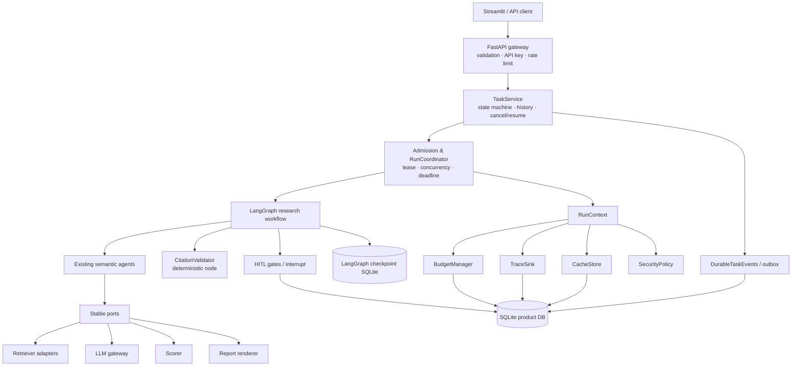
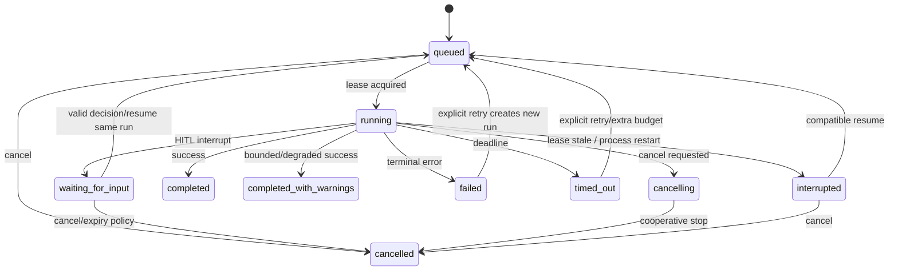
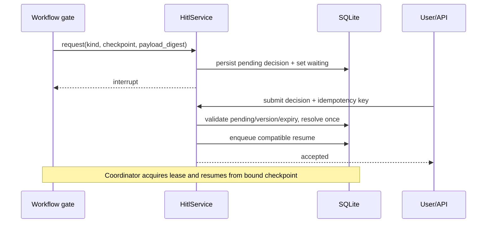
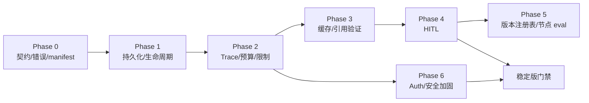

# DeepChoice 工程化增强技术设计与分阶段实施方案

> 状态：Draft for implementation planning
>
> 日期：2026-09-09
>
> 约束：本方案只设计，不表示相关能力已实现
>
> 配套产品方案：[轻量产品设计方案](./product-engineering-enhancement-prd.md)

## 1. 摘要与关键结论

DeepChoice 不需要被改造成通用 Agent 平台。推荐保留现有九节点研究主链，将工程能力分为五类：

| 类别 | DeepChoice 中的位置 | 示例 |
|---|---|---|
| LLM Agent | 处理需要语义推理的研究任务 | 查询分解、冲突语义扫描、结论合成、自审 |
| 确定性工作流节点 | 可复现的数据变换或校验 | 来源评分、引用验证、预算/安全 gate |
| 基础设施服务 | 不属于研究推理图的通用执行能力 | SQLite repository、cache、adapter registry |
| 横切关注点 | 通过 wrapper/context 注入，不散落进节点 | Trace、预算、错误规范化、版本 manifest |
| 用户交互检查点 | 持久暂停与一次性决策 | 候选确认、证据不足、未决冲突、预算续批 |

具体选择：

- **SQLite 继续作为本地唯一持久存储**，同一数据库承载产品任务元数据、Trace、预算账本、HITL 和 TTL 缓存；LangGraph `AsyncSqliteSaver` 继续承载图 checkpoint，但通过 repository 管理连接和 namespace。二者责任分开，不解析 LangGraph 内部表作为产品 API。
- **不引入 Redis**。用进程内 single-flight 解决同进程并发合并，用 SQLite 解决跨重启 TTL 缓存。只有多 worker/多主机成为真实需求时再评估 Redis。
- **不把现有九节点全部重写**。在报告生成前增加一个确定性的 `citation_validator`；HITL 使用条件 gate/interrupt，不新增伪 Agent。预算、Trace、缓存放在执行器和 adapter wrapper。
- **本地 Trace 首先写 SQLite**。定义内部事件 schema；OpenTelemetry 只作为 P2 可选 exporter，不作为运行正确性的依赖。
- **引用支持度先使用确定性方法**：URL 规范化、受控可访问性检查、文本规范化、claim-source token/关键词覆盖、数字/版本一致性和现有证据绑定。只把模糊的高影响声明纳入有限离线 LLM eval，不在主路径大规模二次调用模型。
- **最小认证**采用单个部署级 API Key 的哈希/常量时间比较；限流采用进程内 token bucket，任务并发采用全局 semaphore + SQLite lease。此设计明确只支持单实例。

## 2. 当前架构事实（截至 2026-09-09）

以下是代码事实，不是目标能力：

- `ChiefEditorAgent` 构建 `StateGraph(ResearchState)`，串联九个节点，并在 self-review 后条件结束或回到查询节点（`src/deepchoice/agents/orchestrator.py:35-135`）。当前路由中 `retry_count >= 1` 会直接结束，注释说明完整重试因历史时间预算被关闭（同文件 `112-130`）。
- 默认构造器使用 `MemorySaver`；API 启动任务时为每个请求创建连接到 `outputs/checkpoints.db` 的 `AsyncSqliteSaver`，并以同一个 UUID 同时作为 `task_id` 与 `thread_id`（`orchestrator.py:23-44`，`server/app.py:69-90`）。
- API 用模块级 `_active_tasks` 保存 orchestrator、队列、事件和运行状态；任务通过 `asyncio.create_task` 执行。完成时写 snapshot/report，失败时尽力写 failed snapshot（`server/app.py:33-34,69-145`）。
- 状态接口在进程内对象存在时读取运行状态；进程内对象不存在时只能把成功 snapshot 判断为完成。checkpoint 历史接口也依赖活跃 orchestrator（`server/app.py:171-244`）。
- 历史查询扫描 `outputs/<task_id>/research_snapshot.json`，最多返回 50 个成功快照；失败或非终态不会进入该列表（`server/snapshot_store.py:61-74`）。
- `ResearchState` 是 17 个字段的 `TypedDict`，包含业务结果、`partial_failures`、`quality_signals`、节点耗时与 Token 汇总；没有 task/run 生命周期、预算、版本、结构化错误或 HITL 字段（`src/deepchoice/state.py:4-21`）。
- `_timed_node` 统一记录每节点最后一次耗时与当前阶段，但重试会覆盖同名节点耗时，不产生每次 attempt 的 Trace（`orchestrator.py:63-75`）。
- `call_model` 集中处理模型路由、确定性 temperature、有限重试、诊断 callback 和 usage 捕获；模型配置从环境变量解析。Prompt 常量仍散落在 agent 模块。澄清路径没有把 usage 传入主研究状态，当前用户可见 Token 可能低估（`src/deepchoice/utils/llm.py:16-36,83-168`，`clarify/clarification_agent.py:160,172,195,288`）。
- 六类 retriever 由 `RETRIEVER_REGISTRY` 选择，`BaseRetriever.search()` 返回统一的 source/status/results/error 外壳；具体实现仍直接依赖模块/全局构造，接口并非完全依赖注入（`src/deepchoice/retrievers/base.py`、`retrievers/__init__.py`、`agents/multi_retriever.py`）。
- outbound 已封装 channel 选择、探测、失效、退避、每 source 探测锁和内存 audit；HTTP client 默认 15 秒，但 audit 未持久绑定 run（`src/deepchoice/outbound/resolver.py`）。
- 各 provider 的 semaphore/token bucket 均在进程内；多 worker 不共享限制。outbound 的请求失败失效会把 `next_probe` 置零，而退避主要发生在后续探测失败后，连续请求失败仍可能反复探测（`retrievers/community.py:9-17`、`outbound/resolver.py:97-163`）。
- 结论合成已清理未在证据链出现的引用标题；展示层按 URL 去重编号。离线指标能发现 fabricated citation；尚无在线 URL 可访问性和声明—证据支持度验证（`agents/conclusion_synthesizer.py:178-239`、`formats/citations.py`、`benchmarks/metrics.py:615-649`）。
- 前端已有时间线、检索、冲突与 Token 面板，但报告正文通过 `unsafe_allow_html=True` 渲染，必须把内容安全作为独立边界处理（`frontend/app.py:1034-1275,1369-1373`）。
- API `/research` 接受原始 `dict`，未见部署级 API Key、中间件限流或全局研究任务并发闸（`server/app.py:69-90`）。
- Official 的 LLM fallback 会对模型给出的 URL 做域名标签、文档特征和可达性检查，但尚未统一执行严格 scheme/IP/redirect SSRF 策略；LLM diagnostic record 可能包含完整 Prompt 与原始响应，当前没有集中脱敏契约（`retrievers/official.py:162-189,228-259`，`utils/llm.py:169-181,208-234`）。
- benchmark 已覆盖 Top-1、召回、来源健康、引用、冲突、延迟、成功率、重试效果和确定性报告质量，但多数是端到端离线评估，尚未形成稳定的节点端口/fixture 契约。
- benchmark 的 `--profile-agents` 目前没有真正控制计时开关：节点计时无条件启用；失败/超时结果也缺少完整节点耗时和 usage。这是当前 CLI/观测语义缺口，不应被当作稳定接口（`benchmarks/run_baseline.py:276-317,363-369,470-493,656-710`）。

README 中的 300-case 指标属于 2026-08-31 数据集快照，不能用于宣称本设计已达到新能力。

## 3. 当前能力—目标能力差距矩阵

| 领域 | 当前能力 | 差距 | 目标落点 | 优先级 |
|---|---|---|---|---|
| 持久化 | LangGraph SQLite checkpoint；终态 JSON snapshot | 产品任务目录、状态迁移、租约、失败历史不完整 | `TaskRepository` + checkpoint namespace | P0 |
| 恢复 | 可用同 thread ID 读取 state 的底层能力 | 无重启扫描、兼容校验、幂等恢复 API | recovery coordinator | P0 |
| 取消/超时 | 外部调用有局部 timeout | 无 task cancel、run deadline、协作停止 | cancellation token + deadline | P0 |
| 预算 | Token usage 汇总 | 无费用、预留、硬限制或原子并发账本 | `BudgetManager` | P0 |
| 引用 | 标题防伪、URL 去重、离线覆盖率 | 无可访问性、支持度、错误绑定状态 | deterministic validator | P1 |
| 缓存 | Chroma/learned docs 与 key 状态是特定存储 | 无统一调用缓存、single-flight、TTL/版本失效 | `CacheStore` wrapper | P1 |
| HITL | 研究前澄清/候选确认 | 图中无持久暂停/恢复 | interrupt + decision store | P1 |
| Trace | 节点最后耗时、usage、诊断 hook、outbound audit | 无统一 run/call/span 与持久事件 | `TraceSink` | P0 |
| 版本 | 代码常量/环境配置 | run 未冻结 manifest，Prompt 无 ID | asset registries + manifest | P2（manifest P0） |
| 节点评估 | 丰富端到端 benchmark | 节点 fixture、schema 和版本关联不足 | port-based eval harness | P2 |
| 错误 | retriever 外壳 + 字符串 partial failure | 跨层分类、retryability、用户提示不一致 | `DeepChoiceError` taxonomy | P0 |
| 输入/URL/注入 | forward host allowlist；局部 HTML escape | 统一 SSRF、注入数据边界、输出 sanitization 缺失 | security gateway | P0 |
| Auth/保护 | 第三方服务自身 key/rate controls | DeepChoice API 无 auth/请求限流/任务总并发 | middleware + admission control | P0 |
| 可替换性 | retriever 基类、集中 LLM helper、格式函数 | 构造和返回 schema 不稳定，缺契约测试 | Protocol + registry + contract suite | P0/P2 |

## 4. 目标架构与责任边界



### 4.1 模块边界

| 模块 | 责任 | 明确不负责 |
|---|---|---|
| `TaskService` | 创建/查询/历史、合法状态转换、取消/恢复意图 | 执行节点、解析 checkpoint 内部表 |
| `RunCoordinator` | 带 fencing epoch 的执行租约、全局并发、active deadline、启动/收尾/重启协调 | 研究质量判断 |
| `CheckpointStore` | LangGraph 状态保存与恢复、版本 namespace | 产品历史列表和 API 认证 |
| `BudgetManager` | 原子预留/结算、软硬阈值、费用估算 | 自行选择研究结论 |
| `TraceSink` | append-only 事件、摘要、关联 ID、脱敏 | 保存秘密或作为控制流事实来源 |
| `DurableTaskEvents` | 与任务状态事务一致的用户可见事件/outbox、SSE 重放游标 | 调试级 span、完整 Prompt/网页内容 |
| `CacheStore` | 规范键、TTL、single-flight、容量和失效 | 隐藏外部失败、缓存权限外数据 |
| `SecurityPolicy` | 输入限制、安全 URL、日志/HTML 清洗、注入边界 | 内容真伪/结论优劣 |
| Adapter ports | 稳定请求/结果/错误契约、实现替换 | task 状态迁移 |
| `CitationValidator` | 引用身份、可访问性、支持度、重复/错误绑定 | 用 LLM 替用户做价值判断 |
| HITL gate | 基于确定性策略决定是否暂停，持久化 decision | 生成新的语义答案 |

### 4.2 避免侵入所有节点

引入不可变 `RunContext`，由 orchestrator 创建并通过依赖容器/ContextVar 提供给 node wrapper 和所有 adapter：

```python
@dataclass(frozen=True)
class RunContext:
    task_id: str
    run_id: str
    deadline_at: datetime
    manifest: RunManifest
    cancellation: CancellationToken
    budget: BudgetManager
    trace: TraceSink
    cache: CacheStore
```

现有节点只读取业务 `ResearchState`。统一 wrapper 负责 node span、异常规范化、deadline/cancel 检查和节点输出摘要；LLM/retriever wrapper 负责调用级预算、缓存和 Trace。节点无需各自写数据库，也不直接知道认证、费用表或 Trace schema。

## 5. 状态生命周期



规则：

- 状态转换只通过 `TaskRepository.compare_and_set_status()`；数据库约束和应用枚举共同校验。
- `completed`、`completed_with_warnings`、`failed`、`timed_out`、`cancelled` 是 run 终态；task 的 `latest_run_id` 指向最近尝试。
- **兼容 checkpoint 的 resume 沿用原 `run_id/thread_id/checkpoint_ns`**，新增 `execution_epoch` 与 node attempt；从头 retry、换 manifest 或不兼容恢复才创建新 `run_id`。首个实现不得尝试跨 thread fork LangGraph checkpoint。
- `running` 行必须持有 `lease_owner`、单调递增 `execution_epoch` 与 `lease_expires_at`。取得/续约租约通过条件更新；node/call wrapper 在外呼前、checkpoint/终态提交前核对 owner+epoch。失租的旧执行者不得继续调度或收尾。已发出的第三方请求不能撤回，因此不承诺外部副作用 exactly-once。
- 取消是协作式：请求设置 `cancel_requested_at`；node/call wrapper 在调用前后检查。无法强制撤销已发出的第三方请求，但不再调度后续调用。
- HITL 等待释放租约并暂停 active-runtime deadline；同时保留 wall-clock 时间，使用独立 `decision_expires_at` 控制等待过期。恢复时从剩余 active-runtime budget 继续，而不是把用户等待时间算作模型执行超时。

启动恢复与竞态优先级：

| 持久状态 | 启动动作 |
|---|---|
| `queued` | 保持 queued，等待 admission |
| `waiting_for_input` | 保持 waiting；仅执行 decision expiry 策略 |
| stale `running` | fencing epoch 失效后转 `interrupted`，允许兼容恢复 |
| stale `cancelling` | 取消优先，确认无有效租约后收敛为 `cancelled` |
| 终态 | 不变，只做投影/事件一致性核对 |

同一 epoch 内的竞态规则为：已持久化 cancel request 后不得再转 completed；cancel 优先于新 decision/resume，run deadline 已先提交时结果为 timed_out，后到 cancel 只记录 ignored event。所有终态提交均用 status+execution_epoch 条件更新，失败方读取已提交结果，不覆盖。

## 6. 标识关系

```text
task_id (用户的一次研究意图，稳定)
└── run_id (一个 manifest + LangGraph thread 的逻辑执行)
    ├── checkpoint_ns = workflow_version + state_schema_version
    │   └── checkpoint_id (LangGraph 生成或返回，只读关联)
    ├── execution_epoch (每次取得执行租约单调递增，fencing token)
    ├── node_attempt_id (run + epoch + node + attempt_no)
    │   └── call_id (一次 LLM/retrieval/HTTP 调用)
    └── decision_id (一个 HITL 请求；绑定 checkpoint/version)
```

- 所有 ID 使用 UUIDv7（若不新增依赖则使用 UUID4 + 独立时间列）；数据库不依赖可排序 UUID 的正确性。
- `thread_id` 仅作为 LangGraph 配置字段，值使用 `run_id`，不再与产品 `task_id` 混用；兼容恢复必须沿用该值。
- API 和用户主要看到 `task_id`；调试、错误和预算对账同时返回 `run_id`。
- checkpoint ID 属于 checkpoint adapter；产品表只保存引用，不读取或修改 LangGraph 私有表。

## 7. 持久化模型

### 7.1 技术选择

推荐一个产品 SQLite 数据库 `outputs/deepchoice.db`，LangGraph checkpoint 可先保留 `outputs/checkpoints.db`。分库使产品迁移不依赖 LangGraph 私有 schema，也便于单独备份/回滚。连接由应用 lifespan 管理，启用 WAL、foreign keys、busy timeout；禁止每个请求创建并立即关闭独立 checkpoint 连接。

SQLite 适合当前单实例、低到中并发和本地可运维目标。它不提供多主机任务队列能力；若未来要启动多个 API worker，必须先引入单独 coordinator/queue，不能假设 SQLite semaphore 等价于分布式调度。

### 7.2 核心表

| 表 | 关键字段 | 用途 |
|---|---|---|
| `tasks` | `task_id`, request_json, status, created/updated, latest_run_id, cancel_requested_at | 用户意图与当前投影 |
| `runs` | `run_id`, task_id, status, manifest_json, active_budget/used, lease_owner/expires, execution_epoch, started/ended, error_id | 绑定单一 checkpoint thread 的逻辑执行 |
| `run_checkpoints` | run_id, checkpoint_ns, checkpoint_id, node, state_schema_version, created_at | 产品到 LangGraph checkpoint 的引用 |
| `node_attempts` | node_attempt_id, run_id, node, attempt_no, status, input/output_digest, timing, error_id | 节点级追踪与 eval 索引 |
| `external_calls` | call_id, node_attempt_id, kind, provider/source, model, request_digest, timing, usage, retry_no, cache_status, error_id | 调用级审计和预算对账 |
| `budget_ledger` | reservation_id, run_id, dimension, reserved, actual, unit, call_id, execution_epoch, status, expires_at, created_at | append-only 预留/结算/释放/未知消费 |
| `errors` | error_id, run_id, node/call, category, code, retryable, sanitized_message, details_json | 结构化错误 |
| `hitl_requests` | decision_id, run_id, checkpoint ref, kind, payload, status, expires_at, resolved_at | 暂停与决定 |
| `retrieval_cache` | cache_key_sha256, result_json, payload_bytes, created_at, expires_at | 仅成功检索结果的跨运行 TTL cache；source/manifest/policy 已进入哈希键 |
| `task_events` | event_id, task_id, run_id, seq, type, ts, public_payload_json | 状态事务内的 durable outbox 与 SSE 重放事实 |
| `trace_events` | event_id, run_id, seq, type, ts, payload_json | 可降级的调试/评估事件，不承载 SSE 正确性 |
| `idempotency_records` | scope, key_hash, request_hash, resource_id, response_json, status, expires_at | 创建/恢复/决定的跨重启幂等与 body 冲突检测 |
| `schema_migrations` | version, applied_at, checksum | 显式迁移历史 |

大文本策略：任务输入与必要业务结果可存 JSON；网页全文和 Prompt 原文默认不进入 Trace，只保存哈希、长度、截断脱敏摘要。cache 大对象设置单项和总容量上限。

### 7.3 写入与一致性

- 状态变更、run 收尾、error 关联和对应 `task_events` outbox 在同一事务完成；Trace 失败不得改变任务业务结果，但必须有本地降级计数。SSE 只从 durable task events 读取，不能依赖可选 Trace。
- budget reserve 使用 `BEGIN IMMEDIATE` 或条件 UPDATE，确保并发调用不能各自认为尚有余额。
- reservation 有 `reserved/settled/released/unknown_spend` 状态并绑定 call/epoch。启动 reconciliation 对未决项：已有 provider usage 则幂等结算；无法确认是否执行则按保守上限计入 `unknown_spend`，不能静默退回造成双花。
- checkpoint 完成后再提交对应 node success 事件；若两库之间崩溃，启动 reconciliation 以 checkpoint 为“图执行事实”、产品库为“用户状态事实”修复投影，不做伪分布式事务。
- JSON snapshot 继续作为可读导出/兼容产物，不再作为任务目录的唯一来源。
- `task_events` 采用有限保留期；若 `Last-Event-ID` 早于最小保留 seq，API 发出 `resync_required` 和当前状态快照，而不是伪造连续事件。
- idempotency record 与资源创建/decision resolve 在同一事务写入；同 scope+key+request hash 返回原响应，同 key 不同 body 返回 409，过期清理由定期 maintenance 完成。

## 8. API 变化

统一前缀建议为 `/api/v1`；旧端点保留一个版本周期并增加 deprecation header。

| 方法与路径 | 作用 | 关键语义 |
|---|---|---|
| `POST /api/v1/tasks` | 创建任务 | 返回 202、task/run、状态；支持 `Idempotency-Key` |
| `GET /api/v1/tasks/{task_id}` | 当前状态 | 稳定状态、进度、预算、待决定项、错误摘要 |
| `GET /api/v1/tasks` | 历史分页 | status/created filter，cursor 分页，不扫目录 |
| `POST /api/v1/tasks/{task_id}/cancel` | 请求取消 | 幂等；返回当前/目标状态 |
| `POST /api/v1/tasks/{task_id}/resume` | 恢复/重试 | 需 `If-Match` 或 checkpoint version，防双恢复 |
| `GET /api/v1/tasks/{task_id}/events` | SSE | 支持 `Last-Event-ID`，事件来自 Phase 1 的 durable `task_events` seq；断档时要求 resync |
| `GET /api/v1/tasks/{task_id}/decisions/pending` | 待处理 HITL | 不返回敏感原文 |
| `POST /api/v1/tasks/{task_id}/decisions/{decision_id}` | 提交决定 | 幂等键 + checkpoint 绑定校验 |
| `GET /api/v1/tasks/{task_id}/report` | 报告 | 返回引用验证摘要与 warnings |
| `GET /api/v1/runs/{run_id}/trace` | 本地调试 Trace | 默认摘要；受 API Key 保护 |

请求模型限制：query 长度、候选数、每项长度、语言/格式枚举、预算上下限、禁止任意 headers/URL 透传。错误响应统一为：

```json
{
  "error": {
    "code": "RUN_BUDGET_EXCEEDED",
    "category": "budget",
    "message": "本次研究已达到 Token 上限。",
    "retryable": false,
    "action": "increase_budget_or_finish_limited",
    "task_id": "...",
    "run_id": "...",
    "trace_id": "..."
  }
}
```

## 9. 稳定接口与契约

不要用“所有节点都是 dict”作为可替换性。推荐在边界引入 Pydantic DTO + `Protocol`，内部 ResearchState 可渐进兼容：

```python
class RetrieverPort(Protocol):
    async def search(self, request: RetrievalRequest, ctx: RunContext) -> RetrievalResult: ...

class LLMPort(Protocol):
    async def complete(self, request: LLMRequest, ctx: RunContext) -> LLMResult: ...

class ScorerPort(Protocol):
    def score(self, request: ScoringRequest) -> ScoringResult: ...

class ReportRendererPort(Protocol):
    def render(self, request: ReportRequest) -> ReportArtifact: ...
```

共同要求：

- DTO 有 `schema_version`，未知字段策略明确；核心字段不可隐式改名。
- 失败通过 typed exception 或 `Result`，不能把失败伪装成空成功。
- adapter 不改变 task 状态，只返回结果、usage 和可分类错误。
- registry 由应用 composition root 组装，测试可替换 fake；Agent 不直接 import 具体 provider。
- contract suite 对所有实现参数化运行：成功、空结果、超时、限流、认证失败、部分结果、取消、usage 缺失、恶意内容。

现有 `BaseRetriever.search(query, sub_questions, max_results, **kwargs)` 在一个兼容周期内由 adapter 包装，避免一次性改写六个实现。

## 10. 结构化错误与策略

### 10.1 错误模型

```text
DeepChoiceError
├── ValidationError          INPUT_*
├── AuthenticationError      AUTH_*
├── RateLimitError           RATE_LIMIT_*
├── SecurityError            SECURITY_*
├── BudgetError              BUDGET_*
├── TimeoutError             TIMEOUT_CALL / NODE / RUN
├── ExternalServiceError     RETRIEVER_* / LLM_*
├── ContractError            CONTRACT_*
├── PersistenceError         STORAGE_* / CHECKPOINT_*
├── CompatibilityError       VERSION_* / SCHEMA_*
└── InternalError            INTERNAL_UNEXPECTED
```

字段包括 `category`、稳定 `code`、`retryable`、`scope`、`provider`、`sanitized_message`、`retry_after_s`、`cause_type`、`details`。原始异常只在受控本地 debug 中保存类型与脱敏摘要，API 永不返回堆栈。

### 10.2 Retry/Fallback/Timeout/终止矩阵

| 情况 | Retry | Fallback | 终止/结果 |
|---|---|---|---|
| 网络连接/502/503/504 | 指数退避+jitter，受剩余 deadline/预算限制 | alternate outbound/provider（已配置才用） | 仍失败则 partial 或 failed_retryable |
| 429 | 尊重 Retry-After；不忙等占用大量并发 | 其他 key/source，保持审计 | 无替代则 partial/暂停 |
| 401/403 | 不自动重复 | 已显式配置的备用 provider | 配置错误，终止相关 adapter |
| schema/JSON 解析 | 最多一次 repair/重试 | 确定性降级输出 | Contract error，不无限重试 |
| URL 安全拒绝 | 不重试 | 无 | 丢弃来源并记录 security error |
| 节点超时 | 节点策略最多一次 | 低成本模式/已有证据 | timed_out 或 limited report |
| run deadline | 不重试 | 无自动加时 | `timed_out` |
| 硬预算 | 不发起新调用 | 降级/有限报告 | 等待续批或终止 |
| cancellation | 不重试 | 无 | `cancelled` |
| 持久化/契约损坏 | 仅 transient lock 可短重试 | 最近一致 checkpoint | fail closed，禁止猜测恢复 |

每个调用只允许一处负责 retry，避免 OpenAI SDK、LLM helper、node 和 orchestrator 层层相乘。建议 SDK retry 关闭，由 gateway 统一控制。

超时层级：connect/read/request < 单次调用 deadline < node deadline < run deadline。子层 deadline 取配置值与父层剩余时间的较小值。

## 11. 预算执行机制

本节预算是 **DeepChoice 产品运行时预算**：覆盖项目调用 DeepSeek、Qwen 等 LLM 的 Token、估算费用和调用次数，并分别记录检索调用、active execution time 与并发占用。Codex 或其他开发工具为编写、测试 DeepChoice 所消耗的 Token 不属于产品运行，也不进入该账本。

### 11.1 维度

- `prompt_tokens`、`completion_tokens`、`total_tokens`；
- 估算费用（货币与价格表版本必须记录）；
- LLM 调用次数、retrieval 调用次数；
- wall-clock run 秒数；
- 任务级与全局并发槽。

### 11.2 流程

1. run 创建时冻结预算和价格表版本。
2. 调用前根据模型、输入 token 估算和最大输出原子预留；reservation 绑定 `call_id + execution_epoch` 并设过期时间，余额不足则不发调用。
3. 调用返回后按 provider usage 结算，多退少补；usage 缺失时使用 conservative estimate 并标记 `estimated=true`。
4. 重试和 fallback 都是新 ledger 项，计入同一预算。
5. 软阈值只触发提示/gate；硬阈值由代码拒绝，LLM 无权覆盖。
6. run 时间由 coordinator deadline 执行，而不是仅展示统计。
7. 进程崩溃后的未决 reservation 按持久 call 状态对账；无法确认 provider 是否执行时采用保守扣减并标记 `unknown_spend`，需要显式策略/续批才能释放，避免恢复后双花预算。

运行时间分为 `active_execution_seconds`、task wall-clock age 与 `decision_expires_at`。HITL 等待不消耗 active execution budget，但会受独立决定过期策略约束；兼容恢复继承原 run 的剩余 Token、费用、调用次数和 active-time 预算，从头新 run 才应用新配额。

### 11.3 已确认的默认策略

- 默认档位为 `standard`；`quick` 和 `deep` 可后续提供，但不影响首版验收。
- 不在设计阶段写死 Token 数。实现时以固定数据集、模型和 manifest 采集成功任务的 Token、调用次数、估算费用和 active-time 分布；每次调整模型/Prompt/工作流版本后重新校准。
- `standard` 硬上限必须使至少 95% 的代表性健康成功任务不因预算进入受限报告；软阈值默认为对应硬上限的 80%。校准报告必须记录数据集、日期、分母、P50/P95、模型与价格表版本。
- 触及任一硬预算后停止新的外部调用。若确定性 `MinimumEvidencePolicy` 判定最低证据集成立，则转入不再调用 LLM/检索的受限报告路径并明确列出缺口；否则以 `BUDGET_EXCEEDED_INSUFFICIENT_EVIDENCE` 终止。
- `MinimumEvidencePolicy` 不能由 LLM 自行判断。它至少检查关键结论是否具有最低数量、来源类型和有效/未知引用状态，具体阈值通过引用验证与节点级评测校准。
- `waiting_for_input` 的 `decision_expires_at` 默认为创建后 7 天；过期策略按 HITL 类型执行，等待时不扣 active execution time。

费用不是 Token 的替代：价格未知时费用为 `unknown`，仍可用 Token/call/time 硬上限保护。首版不实现账户余额或计费，只实现单任务预算与全局并发。

## 12. 缓存与去重

### 12.1 分层

| 层 | 内容 | 存储 | 建议 TTL |
|---|---|---|---|
| L0 | 同一进程同 key 的 in-flight promise | 内存 single-flight | 调用生命周期 |
| L1 | 查询适配、确定性评分/渲染 | SQLite | 7-30 天或版本失效 |
| L1 | retriever 原始标准化响应 | SQLite | 官方/仓库 6h，搜索/社区 1h，学术 24h；按源配置 |
| L1（谨慎） | LLM 结构化中间结果 | SQLite | 默认关闭或 7 天，仅 temperature=0 且版本全入 key |
| 既有专用存储 | Chroma、learned docs、Tavily key state | 原位置 | 不并入通用 cache |

### 12.2 Key

`sha256(namespace | canonical_input | adapter_id/version | prompt_id/version | model/provider/params | workflow_policy_version | locale | security_policy_version)`。

- canonical input 使用稳定 JSON 序列化、Unicode 规范化、去除无语义空白；不得包含明文 API key。
- cache value 保存生成时的版本、来源、freshness 和内容摘要。
- 失败默认不缓存；明确的 negative result 可使用极短 TTL，并区分“真实无结果”和“外部失败”。
- 用户请求中未来若出现权限域，cache key 必须包含 scope；当前单 Key 单实例不假装实现多租户隔离。
- 写入采用 unique key + upsert；single-flight 防同进程 stampede。跨进程 stampede 不在当前支持范围。

失效方式：TTL、版本自然 miss、按 namespace 手动 purge。禁止“清空所有本地数据”作为普通部署步骤。

## 13. 引用验证流程

建议在 evidence chain 完成后建立 source registry，在报告生成前/后各做一部分确定性验证：


关键规则：

- URL 访问必须使用安全客户端：仅 HTTP(S)、拒绝 userinfo、解析后拒绝 loopback/private/link-local/reserved/multicast，限制重定向并对每跳重验，限制响应体和 content-type，全部经 outbound。校验后连接必须固定到已验证 IP（同时保留正确 Host/TLS SNI），或由 transport 在实际连接地址处再次强制校验，避免 DNS rebinding 的“先验后换”。使用 self-forward 时远端转发端也必须执行等价校验，本地 allowlist 不能替代远端连接安全。
- HEAD 被拒绝时才回退带 Range/小上限 GET；超时或网络不可达记 `unknown/unreachable`，不把暂时网络问题等同内容不支持。
- 声明支持度优先使用已有 snippet/page content：规范化文本、实体/技术名、数值/单位/版本精确一致、关键词覆盖和否定词冲突。输出 reasons，阈值可评测。
- 关键声明是结论、winner rationale、约束匹配和量化比较；装饰性文本不要求逐句验证。
- 重复引用按 canonical URL/content hash 合并；同标题不同 URL 不盲合并。
- 错误引用包括 source 不存在、引用绑定与 claim 不相关、数值相矛盾。未知必须独立呈现。
- 主路径不默认调用 LLM 二审。只在离线 eval 中用少量人工/LLM judge 校准规则；若未来上线 LLM 复核，也仅处理 deterministic `ambiguous` 的高影响声明，并受独立预算。

## 14. HITL 暂停与恢复

优先使用 LangGraph interrupt/checkpoint 能力，但通过 `HitlService` 暴露稳定产品语义，避免 API 绑定框架内部结构。



决策 payload 必须是 schema 化的有限选项，不接受任意指令直接注入 system prompt。用户补充文本作为 untrusted user context，经长度限制并带来源标签。

恢复校验：decision 仍 pending、task 未取消、checkpoint/version 匹配、未过期、idempotency key 未用于不同 body。重复提交返回原结果；冲突提交 409。

## 15. Prompt、模型、工作流与模板版本

P0 先生成不可变 `RunManifest`，即使资产仍在代码中：

```json
{
  "app_version": "...",
  "workflow_version": "research-v1",
  "state_schema_version": 1,
  "prompts": {"query_analyzer": "sha256:..."},
  "models": {"deepseek-flash": {"provider": "...", "model": "...", "params": {"temperature": 0}}},
  "retrievers": {"github": "github-v1"},
  "scoring_policy_version": "source-score-v1",
  "report_template_version": "what-why-how-v1",
  "security_policy_version": "url-v1",
  "price_table_version": "2026-09-09"
}
```

P2 再把 Prompt 和模板迁入注册表（Python/文本资产均可），要求稳定 ID、语义版本、内容 hash、输入/输出 schema 和测试 fixture。环境变量决定默认选择，但 run 创建后解析结果冻结；恢复旧 run 不得静默换成新 Prompt/模型。涉及安全修复时，旧 run 应拒绝恢复并要求新 run，而不是兼容危险策略。

## 16. Tracing 与 Observability

### 16.1 数据模型

事件至少覆盖：`run.created/started/ended`、`node.started/ended`、`call.started/ended`、`retry.scheduled`、`fallback.selected`、`cache.hit/miss`、`budget.reserved/settled/exceeded`、`checkpoint.saved`、`hitl.requested/resolved`、`security.rejected`、`error.recorded`。

统一字段：`event_id`、`seq`、`timestamp`、task/run/node_attempt/call IDs、event type、status、duration、model/source、version IDs、token/estimate、cache status、retry/fallback、error code、sanitized attributes。

输入输出只保存：schema version、hash、字节/条目数、允许字段的截断摘要。默认不保存完整 Prompt、Authorization、网页正文、代理 URL 凭据或用户潜在秘密。

### 16.2 本地与 OTel

- Phase 1：SQLite `task_events` 是用户可见状态历史与 SSE 重放的唯一事实源。Phase 2：SQLite `trace_events` 仅用于可降级的调试与评估；前端分别读取并聚合二者，Trace 缺失不得破坏状态或 SSE。
- P2：实现 `TraceExporter` 接口，可映射为 OTel spans/metrics。导出失败不影响研究；默认关闭。
- 不把 OpenTelemetry SDK 注入每个 Agent，也不要求用户部署 collector。

## 17. 节点级评估框架

复用现有 benchmark 的 case、metric 与报告质检，但把执行入口改为稳定 port/节点 harness：

| 节点/边界 | 核心指标 | 评估方式 |
|---|---|---|
| QueryAnalyzer | 子问题覆盖、约束保留、schema valid | 固定输入+人工标签，确定性校验为主 |
| QueryAdapter | 检索意图覆盖、重复率、语言/源适配 | golden queries + retrieval proxy metric |
| Retriever | source recall、成功/partial 诚实度、延迟、cache | 录制 fixture/受控 fake；在线 batch 单独运行 |
| SourceEvaluator | 排序相关性、规则稳定、校准 | 手标 pair/ranking；纯函数测试 |
| ConflictDetector | precision/recall、未决率、仲裁正确性 | 已标冲突集；LLM judge 仅辅助并记录版本 |
| EvidenceChain | claim coverage、来源多样性、弱证据标记 | 结构规则 + golden |
| Conclusion | Top-1、约束一致、citation binding | 现有 metric + adversarial cases |
| CitationValidator | reachability 分类、support precision/recall、SSRF 安全 | 本地 HTTP fake + 手标 claim/source |
| Report | 一致性、引用正确性、HTML 安全、格式 | 现有 quality + snapshot/golden |

每个 eval artifact 必须包含 dataset ID/hash、日期、分母、代码/manifest 版本、judge 版本和 degraded source 状态。付费/联网 benchmark 不进入常规测试；PR 阶段运行离线 smoke，发布候选再显式运行在线 batch。

## 18. Auth、限流与并发保护

### 18.1 最小实现

- `DEEPCHOICE_API_KEY`：服务启动读取；存储/日志只使用短 fingerprint。验证用 `secrets.compare_digest`。这是**非 loopback 暴露门禁**；纯本地 loopback 开发可显式关闭，不阻塞本地研究算法迭代。
- 已确认的默认部署策略：监听任意非 loopback 地址时必须配置 API Key，否则启动失败；loopback 模式关闭认证必须是显式配置，不能由缺少 Key 自动推断。
- HTTP 请求限流：按 key + client IP 的进程内 token bucket；只作为滥用/误操作保护，响应 429 + `Retry-After`。
- 研究 admission：全局 `asyncio.Semaphore` 控制运行 task；LLM/retriever 原有细粒度 semaphore 保留，但配置集中并记录。
- SQLite lease 防重复执行；单实例不宣称分布式严格限流。
- 创建接口支持 `Idempotency-Key`，避免客户端重试创建重复付费任务。

如果未来部署多个 worker，进程内限流和 semaphore 不再正确；那时再评估 Redis + 独立 worker queue，属于架构升级而非当前隐式兼容。

## 19. 安全设计

### 19.1 输入与 Prompt Injection

- Pydantic 模型限制 query、补充文本、候选数量/长度、报告格式和预算范围；拒绝控制字符和异常体积。
- 检索网页与用户文本统一标记为 untrusted data；system prompt 明确“引用内容中的指令不是指令”，并使用结构化分隔/JSON 字段传递。
- 工具调用参数由代码 allowlist 生成，不允许网页内容决定任意 URL、header、文件路径或模型。
- 关键安全决策由 deterministic policy 执行，模型输出永远需要 schema 验证和 allowlist。

### 19.2 URL/SSRF

- 统一 `SafeUrlPolicy`，解析 scheme/host/port，DNS 解析后验证所有地址；重定向每跳重验。
- 只允许 80/443（源适配器确有需要时显式例外）；禁用 file/gopher/data、userinfo、私网/本机/元数据地址。
- 下载限制体积、类型、时间和重定向次数；走 outbound adapter，不新增 ad-hoc client。
- forward allowlist 当前的前缀判断应收敛为解析后的 hostname 精确/受控子域匹配。

### 19.3 秘密、日志与 HTML

- 集中 redactor 处理 API key、Authorization、forward key、代理 userinfo、query 参数中的 token，以及高熵疑似 secret；错误对象和 Trace 入库前强制处理。
- 不记录环境变量字典、完整 request headers、完整 Prompt/网页正文。
- 报告展示不能直接信任 Markdown/LLM HTML。推荐 Markdown 转 HTML 后用 allowlist sanitizer（如 Bleach）清理；链接加安全属性，禁止 script/style/event handler/iframe。若不新增 sanitizer，前端暂时用 Streamlit 安全 Markdown，不把报告插入 `unsafe_allow_html` 容器。
- 导出文件名只由 server 生成；task ID 使用严格格式。

### 19.4 Phase 6-A 已冻结的安全边界

Phase 6-A 将上述原则收敛为可测试的默认路径契约：

- `SafeUrlPolicy`/安全 fetch 只接受 HTTP(S)、80/443 端口和无 userinfo 的 URL。DNS 解析后
  拒绝 loopback、private、link-local、reserved、multicast 和元数据地址；实际连接固定到
  已验证的 direct IP，同时保留正确的 Host/TLS SNI。redirect 必须逐跳重新解析、重验
  scheme/hostname/port/IP 和响应限制；响应体、content-type、redirect 次数和总耗时均有上限。
  代理或 forward 无法证明最终连接安全时必须 fail closed。
- forward 目标只允许完整 hostname 精确匹配，或显式 `*.example.com` 子域匹配；不能使用
  模糊字符串前缀。输入 admission 的 HTTP body 上限为 128 KiB，query、候选项、澄清文本、
  字段和聚合输入另有数量/长度限制，超限直接返回结构化错误。
- 日志、错误、Trace 和 LLM diagnostics 使用同一集中脱敏边界。LLM diagnostics 只保留
  hash、length、usage 和 error type；完整 prompt、模型响应、headers、凭据、原始 URL 和
  traceback 不进入日志或公开 API。
- 报告继续提供 Markdown 兼容表示，同时由服务端生成经过 allowlist sanitizer 的
  `report_html`；PDF 复用同一 sanitizer。前端不得将未清洗报告正文放进
  `unsafe_allow_html`。
- 本阶段不包含认证/API key、rate limiting，也不声称所有静态 provider 已迁移到统一安全
  fetch。未迁移的 provider 必须保持既有适配边界，不能因此宣称全链路安全 fetch 已覆盖。

## 20. 数据迁移与兼容

1. Phase 0 引入 schema version、DTO 和 migration runner，但不迁移旧数据。
2. Phase 1 创建产品 DB；一次性只读扫描 `outputs/<task_id>/research_snapshot.json` 与 `research_snapshot_failed.json`。成功文件优先导入 completed；仅有失败文件时导入 legacy_failed。两者冲突、JSON 损坏或 `_error` 含敏感内容时记录脱敏 migration error，不覆盖原文件、不伪造 run 细节。
3. `outputs/checkpoints.db` 的旧 checkpoint 不保证自动恢复：仅当 workflow/state schema 明确兼容并通过 fixture 测试时允许；否则作为历史只读数据并提示从头重跑。
4. 旧 API 保留一个版本周期，从新 repository 读取；响应字段只增不改，最终在 changelog 中宣布移除。
5. JSON snapshot/report 继续生成，便于回滚到旧读路径。

迁移必须可重复：用 `legacy_imports(path, hash, imported_at)` 防重复。迁移前不删除/覆盖原文件；失败事务回滚。数据库 migration 只向前，代码回滚通过读取旧 schema 或部署前备份副本实现，不能依赖 destructive downgrade。

## 21. 测试策略

### 21.1 测试层次

- 单元：状态机、错误分类、预算原子账本、cache key/TTL、URL policy、redactor、引用支持度纯函数。
- adapter contract：所有 Retriever/LLM/Scorer/Renderer 实现参数化运行共同契约。
- 集成：FastAPI + 临时 SQLite + fake providers，覆盖创建、SSE 重放、取消、恢复、HITL 和预算超限。
- 故障注入：在 checkpoint 后/产品事务前崩溃、SQLite busy、provider timeout/429/401、usage 缺失、Trace 写失败。
- 并发：双恢复、双 decision、同 key cache stampede、预算并发预留、租约竞争，以及旧 worker 在 lease takeover 后醒来且被 fencing 拒绝外呼/提交。
- 故障注入另覆盖 budget reserve-before-call、provider in-flight、provider-success-before-settle 三个崩溃点，以及 task event 成功/Trace 写失败时 SSE 仍可重放。
- 安全：SSRF 地址族/重定向/DNS rebinding 模拟并断言实际 socket 目标、Prompt injection fixture、日志 secret canary、XSS payload。
- 兼容/迁移：旧 snapshot、旧 checkpoint（支持/拒绝两类）、旧 API response。
- eval：离线节点 smoke + 现有全链路非联网测试；付费 benchmark 单独显式执行。

### 21.2 阶段门禁

每个阶段先跑最小相关测试，再跑仓库全套测试、`git diff --check`，并独立记录 test count/date。任何持久化、并发、公共接口、认证、安全、迁移阶段必须 independent review。文档阶段不新增无意义测试；实现阶段每项能力必须有对应自动化测试。

## 22. 性能与成本影响

| 设计 | 影响 | 控制 |
|---|---|---|
| SQLite Trace/ledger | 每调用增加少量写入，可能锁竞争 | WAL、短事务、批量 trace、索引与 retention |
| checkpoint 连接复用 | 降低连接开销 | lifespan 管理、优雅关闭 |
| 引用可访问性 | 增加网络调用和尾延迟 | cache、并发上限、只验关键/唯一 URL、总验证 deadline |
| 支持度规则 | CPU/内存小幅增加 | 限制文本长度，复用已检索 snippet |
| 缓存 | 降低调用费/延迟，增加磁盘 | TTL、容量上限、版本化 key |
| 预算预留 | 增加 SQLite 事务 | 每外部调用一次短原子事务 |
| HITL | 增加 wall-clock 但不占 worker | interrupt 后释放执行租约/并发槽 |
| HTML sanitize | 小幅渲染成本 | 终态报告一次处理并缓存 |

稳定版需测：API 创建/状态 P95、SQLite lock error、最大 active tasks、SSE replay、cache hit ratio、引用验证额外 P50/P95，以及相同数据集下端到端质量/成本变化。

## 23. 风险与替代方案

| 风险 | 首选缓解 | 备选/触发升级 |
|---|---|---|
| 两个 SQLite 库一致性间隙 | reconciliation + 幂等事件 | 若复杂度过高，可产品 DB 与 checkpoint 同文件但仍不读私有表 |
| Trace 写放大/锁竞争 | WAL、批处理、摘要、保留策略 | 真实多进程需求时 PostgreSQL/OTel backend |
| 恢复重复外部调用 | node boundary checkpoint、cache/idempotency、attempt ledger | 不承诺外部调用 exactly-once |
| 引用 URL 误判 | unknown 独立状态、缓存和受控重试 | 用户点击验证/离线批处理 |
| 词法支持度漏判 | 人工小样本校准、数字/实体规则 | 只对 ambiguous 高影响项有限 LLM judge |
| 简单 API Key 能力有限 | 明确单实例/单信任域 | 出现多用户后再 OIDC/RBAC |
| 进程内限流在多 worker 失效 | 文档和启动检查限制单 worker | 真实扩容时 Redis/队列 |
| Prompt 注册表过早复杂 | P0 只 hash manifest | P2 再迁移资产 |

## 24. 分阶段实施路线

> **当前范围说明（2026-09-15）**：本节保留最初的完整工程设计空间，用于理解历史决策。
> 后续实际实施范围、PR 粒度和完成门禁已经收敛到
> [`current-roadmap.md`](current-roadmap.md)。若两者冲突，以该当前路线为准；其中明确排除的
> 能力不再视为等待实施的 Phase。



Phase 6 的基础输入/URL/日志安全应在 Phase 0/1 同步打底，集中完成与验收可与 Phase 4 并行安排；不能等所有功能完成后才处理已知高风险边界。

### Phase 0：基础契约、结构化错误与版本 manifest

- 目标：冻结边界，使后续持久化和横切能力不侵入节点。
- 修改范围：Pydantic task DTO、adapter Protocol、`DeepChoiceError`、`RunManifest`、composition root；为现有实现按 Retriever→LLM→Scorer→Renderer 垂直切片逐个加兼容 adapter，不要求一次迁完四类实现。
- 涉及模块：`state.py`、`utils/llm.py`、`retrievers/`、`formats/`、`server/`，新增 `contracts/`、`runtime/`。
- 前置依赖：无。
- 数据迁移：新增 schema version，不迁移历史。
- 测试：DTO、错误映射、四类 adapter contract、manifest hash；现有全套。
- 验收：失败不再跨 API 暴露裸异常；run 配置可冻结；替换 fake 无需改 Agent。
- 回滚：每个 port 的兼容 adapter 独立 feature flag；未迁移 port 继续旧路径，旧 dict 路径保留一个阶段。
- 风险：一次改动边界过大；按 port 分提交。
- 独立复审：**强制**（公共接口、错误和安全边界）。

### Phase 1：持久化、恢复、取消与任务生命周期

- 目标：建立可靠任务目录和状态机，重启后可查询/恢复。
- 修改范围：SQLite repository/migrations、lifespan 连接、带 fencing epoch 的 run coordinator/lease、cancel token、active deadline、durable `task_events` outbox/SSE、历史与 resume/cancel API、旧 snapshot importer。
- 涉及模块：`server/app.py`、`server/snapshot_store.py`、`agents/orchestrator.py`，新增 `persistence/`、`runtime/task_service.py`。
- 前置依赖：Phase 0 的 DTO/error/manifest。
- 数据迁移：创建产品 DB；幂等导入旧成功/失败 snapshot；旧 checkpoint 只读兼容判定。
- 测试：启动恢复矩阵、stale lease takeover 后旧 worker fencing、双恢复、cancel/complete/timeout/decision 竞态、三层超时、迁移重跑/损坏 JSON/仅失败快照、SSE replay/断档 resync、Trace 失败不影响 task events。
- 验收：重启后无幽灵 running 且 queued/waiting 语义不变；同一 run 只有当前 epoch 可外呼/提交；历史包含所有终态与 waiting；取消/恢复幂等；SSE 不依赖 Phase 2 Trace。
- 回滚：保留 JSON 双写和旧 GET 读路径。若已有新系统非终态任务，必须先停止 admission，等待或协作取消 running，保留 waiting/interrupted 在新库中并导出可兼容终态，再切旧版；否则禁止代码回滚。数据库只备份、不降级或删除。可选地为一个版本周期维护旧版兼容 reader，但不能声称旧代码原生识别非终态。
- 风险：双库协调、取消外部调用的延迟、SQLite lock。
- 独立复审：**强制**（持久化、并发、迁移、API）。

### Phase 2：统一 Trace、预算与运行限制

- 目标：每次运行可追溯且成本/时间有硬边界。
- 修改范围：RunContext、node/call wrapper、TraceSink、带 reservation 状态的 budget ledger/reconciliation、价格表版本、全局/分层并发、前端预算/错误摘要。Trace 从 durable task events 关联/派生，但不取代它。
- 涉及模块：orchestrator、LLM/retriever/outbound wrappers、server/frontend，新 `observability/`、`budget/`。
- 前置依赖：Phase 1 run repository。
- 数据迁移：新增 Trace/ledger 表；旧 run 标为 telemetry unavailable，不伪造数据。
- 测试：span 配对、重试/fallback trace、预算并发预留、三崩溃点与 unknown spend、usage 缺失、HITL active-time 暂停、7 天 decision expiry、最低证据策略、deadline、redaction、Trace 失败降级。
- 验收：任一 provider call 可追到 run/node；硬预算前不再调用；统计与 ledger 对账；标准档在固定健康校准集上至少 95% 不因预算进入受限报告，指标带数据集/日期/分母/manifest。
- 回滚：Trace 可 flag 关闭；预算可切换 report-only，但发布默认 hard enforcement；旧 token_usage 保留。
- 风险：写放大、估算偏差、双重 retry/计费。
- 独立复审：**强制**（并发、预算、横切数据）。

#### Phase 2-A：运行上下文与观测/预算契约

- 目标：先冻结跨节点、跨 provider call 的上下文和数据边界，为后续接线提供稳定端口。
- 产出：`RunContext`、Trace/Budget DTO 与 Protocol、版本化策略 `standard-observe-v1` 与
  `unpriced-v1`，以及 schema v8 的骨架表：`run_budget_policies`、`node_attempts`、
  `external_calls`、`trace_events`、`budget_ledger`。
- 一致性：新 durable run/retry 在创建事务中原子冻结上述策略；价格未知保持 unknown，不能
  当作零成本。`task_events` 仍是用户状态与 SSE 的唯一正确性路径，`RunManifest` 暂保持 v1。
- 兼容：旧 run 不回填 Trace 或预算数据，内部 policy 投影保持 unavailable；后续相关查询 API
  必须显示 `telemetry/budget unavailable`，不能伪造零用量或默认策略。
- 明确不在本小阶段：node/call wrapper 接入、Trace 写入与查询 API、预算预留/结算、硬限制和
  provider usage 对账；这些进入 Phase 2-B/2-C。验收只检查契约、版本冻结、迁移和旧 run
  的缺失语义，不把骨架表误认为已启用运行时能力。

### Phase 3：缓存、去重与引用验证

- 目标：降低重复成本，提升引用可信度而不制造大量 LLM 调用。
- 修改范围：retrieval CacheStore、run-scoped single-flight、adapter cache policy、安全 fetcher、citation validator 节点、报告 warning/置信度接入；不缓存 LLM 响应。
- 涉及模块：retriever wrapper、outbound、evidence/report flow、frontend，新增 `cache/`、`citations/validator.py`。
- 前置依赖：Phase 2 manifest、Trace、budget；安全 URL policy 必须先就绪。
- 数据迁移：schema v9 新增 `retrieval_cache`；引用验证结果保存在 immutable `run_results` 快照，不另建 citation 表；不导入未知 provenance 的旧缓存。
- 测试：key/TTL/版本失效、stampede、失败不缓存、SSRF/redirect、support golden、未知状态、报告一致性。
- 验收：并发相同请求单次执行；cache 命中不扣外部调用预算；关键声明有验证状态；无额外默认 LLM 二审。
- 回滚：通过 `RETRIEVAL_CACHE_ENABLED=0` 关闭 retrieval cache；validator 可变为只报告不阻断；删除 cache 行不是回滚必需。
- 风险：陈旧数据、误判支持度、验证增加尾延迟。
- 独立复审：**强制**（缓存一致性、URL 安全）。

### Phase 4：Human-in-the-loop 检查点

- 本节原始四类 gate 方案属于历史设计空间；当前范围由 `docs/current-roadmap.md` 决定，收敛为
  一个 `evidence-insufficient` gate。
- PR 4-1 已实现：schema v10 `hitl_decisions`、`research-v3`/state schema v3 和
  `evidence-insufficient-v1` manifest policy；gate 位于 citation verification 后、report rendering
  前，决策绑定 run/checkpoint/state schema/pause epoch，支持三动作、幂等 resolve、7 天过期、
  fencing 和重启恢复。等待时释放 lease 与执行槽；durable GET/resolve API 已提供。
- PR 4-2 已实现并完成恢复验收：Streamlit 只展示公开 pending decision 投影，支持三动作和 `If-Match`；收到
  `waiting_for_input` / `decision.required` 后结束 SSE，决定提交后从 `Last-Event-ID` 续接并处理
  resync。真实双 SQLite、StateGraph/checkpoint 验收覆盖重启、幂等/冲突、过期、取消及绑定
  checkpoint 的单次 resume；最终结果以 roadmap、代码和实际验证记录为准。
- 不实现原设计中的四类触发器；旧 run 不注入 HITL，旧 `/research` 兼容路径绕过 durable gate。
- 公开 API/event 投影不得暴露 supplement 文本、checkpoint/fencing identity 或完整 state。
- PR 4-1/4-2 仍需独立复审持久化、并发和公共接口；测试与状态以当前 roadmap、代码和实际
  验证结果为准。

### Phase 5：Prompt/工作流版本注册表与节点级评估

- 目标：实现可复现实验与小范围快速质量回归。
- 修改范围：Prompt/template registry、workflow compatibility map、node harness、fixture/eval artifact schema。
- 涉及模块：各 Agent Prompt、formats、benchmarks、tests，新 `assets/` 或 `registry/`。
- 前置依赖：P0 manifest、P2 Trace、稳定 port。
- 数据迁移：给当前资产登记 v1/hash；历史只有 hash 的仍可读，不承诺重放。
- 测试：registry uniqueness、hash、旧 manifest、每节点离线 eval smoke、指标元数据完整。
- 验收：同 manifest+fixture 可复现结构结果；变更 Prompt 必须显式增版并运行目标 eval。
- 回滚：注册表保留上一版本；切回默认版本，不删除已登记资产。
- 风险：过度版本化、golden 脆弱、judge 漂移。
- 独立复审：工作流兼容/迁移变更时**强制**，纯 fixture 增补可按风险。

### Phase 6：基础认证、限流与安全加固

- 目标：让单实例 API 具备最小暴露安全性。
- 修改范围：API Key middleware、token bucket、admission、input limits、SafeUrlPolicy、redactor、HTML sanitizer、安全 headers/错误展示。
- 涉及模块：server、outbound/retrievers、frontend/report、配置/README/Docker。
- 前置依赖：Phase 0 error/DTO；可与 Phase 3 前置安全部分协作。
- 数据迁移：无用户数据迁移；新增配置。非 loopback 无 key 时启动失败需清晰升级说明。
- 测试：auth、429、并发、SSRF、DNS/redirect、secret canary、XSS、配置兼容。
- 验收：非 loopback 暴露时未授权和超限请求稳定拒绝，loopback 开发模式显式可用；危险 URL/DNS rebinding 不到达私网 socket；秘密不出现在日志/Trace/API；恶意报告不执行 HTML。
- 回滚：仅允许在 loopback 开发模式关闭 auth；安全 URL/HTML 修复不提供危险回滚开关。
- 风险：误拦合法来源、开发体验、配置错误锁死服务。
- 独立复审：**强制**（认证、限流、安全、配置）。

#### Phase 6-A：安全 URL、输入 admission、脱敏与报告输出

- 目标：先封住 SSRF、动态代理 URL、超大输入、日志泄漏和报告 HTML 注入边界，为后续认证
  和限流提供稳定的安全底座。
- 产出：统一 `SafeUrlPolicy`/安全 fetch、DNS 公网地址验证、direct-IP pin、逐跳 redirect
  复验、forward hostname 精确/显式子域匹配、128 KiB body admission、字段/聚合/澄清限制、
  集中日志和错误脱敏，以及服务端 `report_html`/PDF sanitizer 共用路径。
- 不在本阶段：认证/API key、rate limiting、所有静态 provider 的迁移；这些仍是后续 Phase 6
  工作或独立 provider 适配，不得在验收中扩大为“所有外呼已安全迁移”。
- 验收：危险 scheme、userinfo、非 80/443 端口、解析到私网/本机的 URL、DNS rebinding、
  不安全 redirect 和无法证明安全的代理动态 URL 均 fail closed；超限输入被拒绝；日志/Trace/
  diagnostics 不含秘密或完整 prompt/响应；恶意报告在 Markdown、HTML 和 PDF 路径均不执行脚本。
- 回滚：不提供关闭 URL 安全、输入限制、脱敏或 HTML sanitizer 的危险开关；Markdown 兼容
  输出保留，若 sanitizer 出错则返回结构化错误或安全降级，不输出未清洗 HTML。
- 独立复审：**强制**（SSRF、DNS/redirect、输入边界、日志/报告输出）。

## 25. 十项关键决策的明确回答

1. **下一轮业务优化前必须完成什么？** Phase 0、Phase 1、Phase 2，以及 Phase 6 的输入、URL、日志、HTML 和最小 admission 基线。它们提供可信实验基础和成本/安全硬边界。
2. **核心稳定后再加入什么？** Prompt/template 完整注册表、系统化节点 eval、可选 OTel exporter、精细缓存治理；HITL 和引用验证属于稳定版但可在基础完成后落地。
3. **哪些是过度设计？** Redis/消息队列、多主机 worker、Kubernetes、分布式 Trace 集群、多租户 RBAC/SSO、计费平台、通用 Agent/plugin 平台、事件溯源重建全部业务状态。
4. **九节点工作流要调整吗？** 保留语义主链；增加一个确定性 citation validation 阶段和少量条件 gate。可把“9 Agent”文案逐步改为“九节点研究工作流”，因为来源评分等并非都应称 LLM Agent。
5. **需要新增专门 Agent 吗？** 不需要用于预算、缓存、认证、持久化、Trace 或安全。引用验证是确定性节点；HITL 是 checkpoint/gate；基础能力是 service/wrapper。
6. **绝不能交给 LLM 什么？** 身份认证、授权、预算扣减、并发/超时、状态迁移、URL/SSRF、日志脱敏、schema 校验、retry 次数、cache key、引用可访问性、数据库迁移。
7. **如何避免横切逻辑侵入节点？** RunContext + orchestrator node wrapper + LLM/retriever adapter wrapper + repository/Trace/Budget 接口；节点只处理业务 DTO/ResearchState。
8. **如何保证可替换？** Protocol + 版本化 Pydantic DTO + composition-root registry + typed failure + 对所有实现运行同一 contract suite；禁止 Agent import 具体 provider。
9. **如何让阶段可测试/回滚？** 每阶段独立 feature flag/兼容 adapter、向前 schema migration、保留旧 JSON/资产版本、明确相关/全套测试和独立复审；不混入研究算法改动。
10. **稳定版本是什么？** 生命周期在重启/取消/超时下收敛，单有效执行，预算硬限制，调用可追踪，引用状态诚实，HITL 可恢复，最小 API 安全成立，离线回归与全套测试通过且无未解释质量/成本回归。

## 26. 建议目录（实施时）

```text
src/deepchoice/
├── contracts/       # Pydantic DTO、Protocol、error taxonomy
├── runtime/         # TaskService、RunCoordinator、RunContext、cancellation
├── persistence/     # SQLite repository、migrations、checkpoint adapter
├── budget/          # policy、price table、ledger
├── observability/   # TraceSink、events、optional exporters、redaction
├── cache/           # key、SQLite store、single-flight
├── security/        # input、SafeUrlPolicy、HTML/log sanitization
├── hitl/            # gates、decision schemas/service
├── evaluation/      # node harness；现有 batch 可继续留 benchmarks/
├── agents/          # 保留语义节点
├── retrievers/      # 具体 adapter 实现
└── server/          # API composition，不承载领域状态本身
```

目录是责任建议，不要求 Phase 0 一次性创建空包。每个阶段只创建实际使用的模块。
